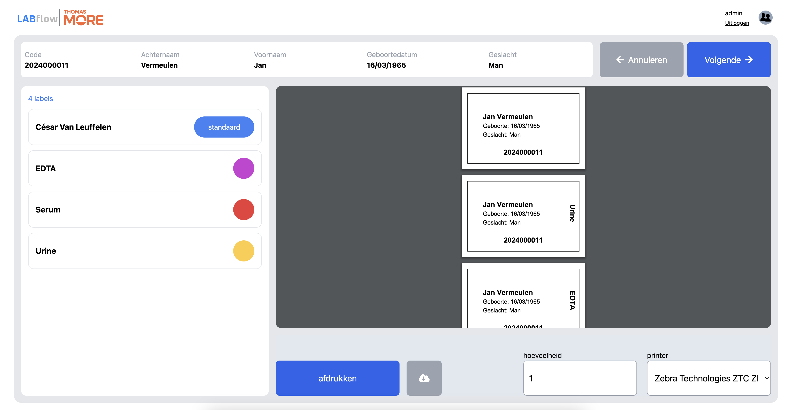
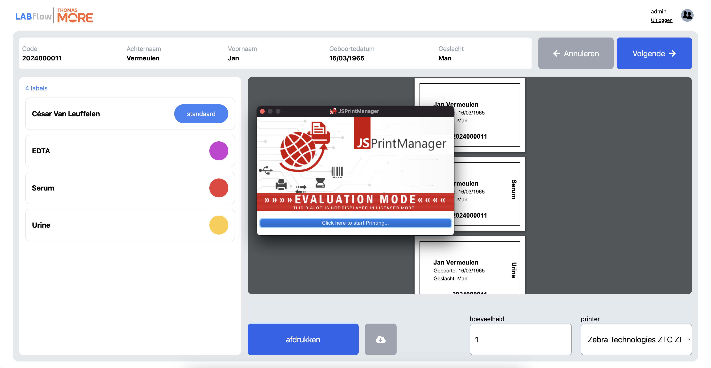

# Installatie handleiding LABflow

In dit document geven we uitleg rond hoe je de LABflow web applicatie kan recreëren en zelf kan installeren.

**Inhoudstafel:**

- **1** - Hoe project aanmaken
- **2** - Project klaar voor development
- **2.1** - database
- **2.2** - backend
- **2.3** - frontend
- **3** - project deployen naar productie
- **3.1** - database
- **3.2** - backend
- **3.3** - frontend
- **4** - PC installaties
- **4.1** - Disclaimer

## 1 - Hoe project aanmaken

Eerst en vooral gaan we bespreken hoe je de LABflow applicatie zelf van scratch kan opstarten. Hieronder wordt stap voor stap uitgelijnd hoe je tot op hetzelfde startpunt kan komen als wij zijn gestart.

**surf naar volgende website [spring boot initialiser](https://start.spring.io/)**

> op volgende site kan je een java springboot project starten zonder zelf te moeten configureren. Deze site gaat voor jouw een pom.xml file maken met alle nodige info voor een springboot project en jij kan zelf selecteren welke versies je wil gebruiken van java, maven, etc.

**settings:**

- project: Maven
- language: Java
- springboot: 3.3.4
- group: com.thomasmore.blc
- artifact: LabFlow
- name: LabFlow
- packaging: jar
- java version: 17

Je krijgt een ZIP file en deze moet je unzippen en openen in je IntelliJ

surf naar [mvnrepository.com](https://mvnrepository.com/) en voeg volgende dependencies ook nog toe:

- [ ] [SQLite JDBC](https://mvnrepository.com/artifact/org.xerial/sqlite-jdbc)
- [ ] [Spring Boot Starter Web](https://mvnrepository.com/artifact/org.springframework.boot/spring-boot-starter-web)
- [ ] [Hibernate ORM hibernate community dialects](https://mvnrepository.com/artifact/org.hibernate.orm/hibernate-community-dialects)
- [ ] [Spring Boot DevTools](https://mvnrepository.com/artifact/org.springframework.boot/spring-boot-devtools)
- [ ] [Spring Boot Starter Test](https://mvnrepository.com/artifact/org.springframework.boot/spring-boot-starter-test)

## 2 - klaar voor development

### 2.1 - Back-end

> bij het openen van het project krijg je normaal 2 grote errors

- .env ontbreekt
- Alle files met .db extensie ontbreken

ga naar application.properties

> path: src > main > resources > application.properties

plaats volgende code in deze file:

```# .env import
spring.config.import=file:.env[.properties]

spring.application.name=labflow

# database connection

# the datasource url points to our database

spring.datasource.url=jdbc:sqlite:databases/labflow.db
spring.jpa.database-platform=org.hibernate.community.dialect.SQLiteDialect
spring.jpa.hibernate.ddl-auto=create-drop
spring.datasource.driver-class-name=org.sqlite.JDBC

spring.datasource.username=${env.DATABASE_USERNAME}
spring.datasource.password=${env.DATABASE_PASSWORD}

spring.jpa.show-sql=true
```

**maak een nieuwe .env aan:**

1. maak een duplicaat van de file `.env.example`
2. daar plaats je 2 zaken in `DATABASE_USERNAME=admin123` en `DATABASE_PASSWORD=admin123`

**maak de database map en file aan:**

1. in de root van je applicatie maak je een map `databases` aan
2. daarin zet je een file `labflow.db`

> path: databases/labflow.db

3. open rechts de tool voor databases
4. sleep de labflow.db file in het venster van de database tool

**Laat het project runnen en kijk of het werkt!**

> werkt het toch niet contacteer [Nathan Neve](mailto:r0742822@student.thomasmore.be) of [César Van Leuffelen](mailto:r0929448@student.thomasmore.be)

### 2.2 - Front-end

Voor de front-end gebruiken we **Svelte**: documentatie -> [docs](https://svelte.dev/docs/introduction).

Installatie:

```bash
npm create svelte@latest labflow-frontend
cd labflow-frontend
npm install
npm run dev
```

Door het uitvoeren van deze commando's maken we een startproject aan. Hierna installeren we onze nodige packages met `npm install`.

Met `npm run dev` starten we een development server op, op poort 5173, dit is de standaardpoort voor Svelte applicaties.

voor windows & mac: [http://localhost:5173/](http://localhost:5173/)
voor Linux/Unix-based systemen: [http://0.0.0.0:5173/](http://0.0.0.0:5173/)

Meer informatie te vinden in code\labflow-frontend\README.md

#### 2.2.1 hosting

Voor onze frontend te hosten hebben we gekozen voor Github Pages.  
Documentatie: [tutorial hosting svelte app to github pages](https://www.okupter.com/blog/deploy-sveltekit-website-to-github-pages).  

## 4 - PC installaties

Wanneer je labels wil afdrukken op onderstaand scherm. Kan je een van de Zebra ZD421 label printers aansluiten op je laptop doormiddel van de bijgevoegde usb kabel. Je zal merken dat wanneer je op de knop 'afdrukken' duwt er niets zal gebeuren. Hiervoor moeten we op de gebruikte PC een klein programmatje downloaden. Dit programma'tje, genaamd **JSPrintManager**, is geschreven door de mensen van [NEOdynamic](https://www.neodynamic.com/). Zij maken allerlei software programmas voor het verbinden van software met hardware van printers. **VEILIG DUS**



We raden aan om enkel de link gebruikt in deze documentatie om virussen en gevaarlijke programmas te vermijden.

Als je op deze [link](https://www.neodynamic.com/downloads/jspm/) drukt kom je terecht op een pagina waar je de JSPrintManager software veilig kan downloaden. Kies eerst en vooral het juiste OS waar je op werkt. Als je windows gebruikt zal je een uitvoerbaar bestand downloaden. Wanneer je een mac gebruikt zal er een .pkg bestand downloaden.

>⚠️ Het kan zijn dat je computer het bestand niet wilt starten omdat hij niet zeker is of het wel veilig is. Zolang je het bestand hebt gedownload van de link hierboven is het bestand normaal veilig!

Wanneer je dit hebt gedaan (ongeacht welke systeem je gebruikt) mag je naar je 'download' folder gaan en dubbel klikken op het net gedownloade bestand. Er zal een installatie pop komen waar je moet doorlopen. Ga erdoor en pas niets aan.

Wanneer je dit hebt gedaan zou de applicatie automatisch moeten opstaan. Als je nog altijd niets zou kunnen afdrukken zoek dan naar de applicatie en doe hem open net zoals je eender ander applicatie zou starten.

Top! Je bent klaar om te starten met labels printen

## 4.1 - Disclaimer

Wanneer je probeert af te drukken gaat de software eerst een nogal verontrusttend scherm laten zijn zoals afgebeeld onderaan. Dit is compleet normaal. Dit is omdat we de gratis versie van de software willen gebruiken. Geen zorgen, klik gewoon op de afdruk knop en wanneer als juist geïnstalleerd is en aan staat zullen de labels starten met printen.

**prijs licensie:** €150 per maand


